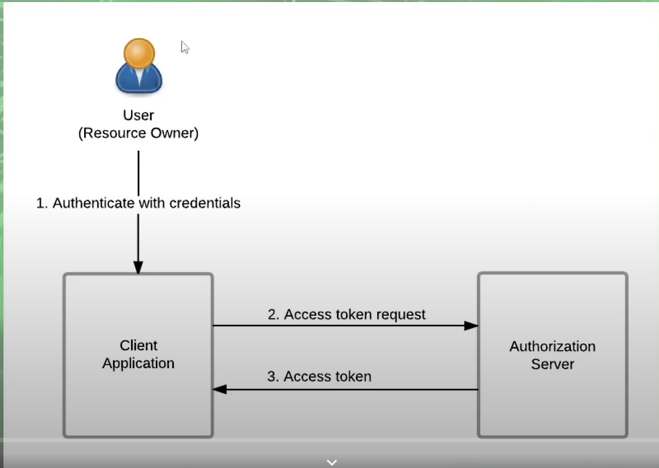

# Demo Restfull API Security
## Overview
- The purpose is to understand what the core of JWT is, how a miniature spring security configuration works,understand how I configure all the HTTP security for our application, if you are still confused about this, watch it to understand how works, I have a pretty solid explanation of the core parts(for Vietnamese people).
-  The ones I use in this test are java, Mysql, Spring boot, Spring Security, Lombox,JSON Web Tokens (JWT),BCrypt, JPA, Hibernate ...
## Features
* Authentication: is the process of verifying the identity of a user. It ensures that the entity is who or what it claims to be, typically through methods like passwords, biometrics, or security tokens. Authentication is a critical component of security, as it helps prevent unauthorized access to resources and information.
* Authorization : is the process of determining whether a user, device, or system has permission to access certain resources or perform specific actions.Authorization helps enforce access control policies and prevent unauthorized activities within a system.
## Set request body as raw with JSON payload
### PostRequest Auth Login
 * {
  "username" : "user",
  "password" : "1"
  }
## Postman
### Get information from demo-controller
* Get infor with endpoint permitAll

* Get infor with auth access is User 

# Explain
## SecurityFilterChain

## JWTAuthenticationFilter

#Spring Oauth2
## Overview 
- OAuth2 (Open Authorization 2.0) is a standard protocol used to provide secure authorization mechanisms for web and mobile applications.
It allows applications to access user resources on other web services without needing to disclose the user's login credentials.
## Activity Flow

## Grant Type
###  Password: 
- The Resource Owner Password Credentials Grant type is used when the user trusts the client application with their credentials. This flow involves the user providing their username and password directly to the client.

###  Client Credentials
-- Allows between App server and Authurization Server

### Implicit 
- User logs in, receives an access token directly in the URL fragment.

### Authorization Code Grant
- User logs in, receives authorization code, exchanges it for an access token.

## Step By Step with Login Google OAuth2
### Step 1 :  Đăng kí Google Console Developer
### Step 2 : Xây dựng fe và yêu cầu ủy quyền
- Front-end sẽ xây dựng layout và khi click tới login Google thì sẽ Target Url của goggle Authentication
TargetUrl sẽ như sau : const targetUrl = `${authUrl}?redirect_uri=${encodeURIComponent(
  callbackUrl
  )}&response_type=code&client_id=${googleClientId}&scope=openid%20email%20profile`; 
trong đó: authUrl là tham số đến gg auth authUri: "https://accounts.google.com/o/oauth2/auth",
redirect_uri: là tham số mà sau khi xác thực xong sẽ redirect về đó ở đây tôi đang để với Ứng dụng
React là redirectUri: "http://localhost:3000/authenticate" thì sau khi thành công thì nó sẽ trả về trang này , Đối với client_id thì là cái Id mà chúng ta đăng kí với gg

### Step 3: Xác nhận ủy quyền với goggle
- Ở bước này thì chúng ta sẽ xác nhận và chấp nhận ủy quyền với ứng dụng đó
### Step 4: Sau khi xác nhận thành công thì fe sẽ nhận được mã code mà goggle trả về
- Example : http://localhost:3000/authenticate?code= ; code ở đây là google tự trả về cho mình
Sau khi có được code thì fe sẽ lấy code đó và truyền lên cho Be xử lí

### Step 5: BE sẽ exchangeToken và trả về token và thông tin cho Fe và fe sẽ dùng token để request
- Sau khi nhận được được Code từ fe gửi lên thì Backend sẽ xử lí code đó và gửi lên trên google
để nhận được Response chứa các thông tin như Token, AccessToken
- Các bước xử lí của Backend
* Bước 1 : Backend sẽ được gọi đến endpoint này

- Bước 2: Cấu hình các thông số như Client id, secret, Redirect_uri(Như Url đã đăng kí trên gg)
- Bước 3: Tạo Repository Client để chuyển hướng dùng Feign Client để chuyển hướng đến các http
của google 

Thông số url là chuyển hướng đến https://oauth2.googleapis.com/token để exchangeToken với
các thông số như client_id,client_secret,code,grant_type,redirect_uri
 đây là đoạn code để gọi đến endpoint đó
- Bước 4 : Google sẽ trả về kết quả nếu như hợp lệ là một chuỗi Json cho Be
Chuỗi Json có các thông tin như sau: 
Với accessToken, expiresIn,Refresh_token, scope, toke_type
- Bước 5 :  Backend sẽ lại dùng accessToken để gọi lên Google để lấy thông tin User

Be sẽ chuyển hướng tới url là :https://www.googleapis.com/oauth2/v1/userinfo để lấy về các thông tin của user mà gg trả về như email, tên, profile
.Be sẽ lưu User đó vào trong Database với các thông số mà Google cho phép( Ở bước này chúng ta có thể viết thêm API tạo mật khẩu để cho User đó có mật khẩu)
. Vì là sau khi gg xác thực thành công thì nó sẽ lưu trong cookie nên chúng ta lần sau sẽ ko cần phải nhập nữa
. Be sau khi lưu được user thì sẽ tạo token dựa trên User đó để gửi về cho fe 

- Bước 5 :  Backend Nhận được thông tin trả về từ Google thì sẽ tạo token và trả về cho Front-end để fe có thể 
lưu các thông tin mà Backend trả về ở dưới LocalStorage
- Bước 6: Mỗi lần request thì Fe phải gửi kèm theo JWT(token đã lưu trước đó) để Filter Token
để Authentication xem User đó có tồn tại trong hệ thống hay không. Nếu tồn tại thì sẽ dựa theo Role để
cung cấp các resource server cho User đó.
## Sau đây là các bước để Oauth2 với google
# End
Thank you. That is all and i'm Bao - Truong Duc Bao